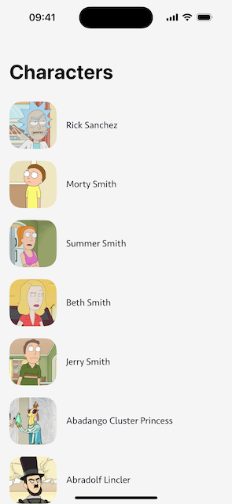

# RickAndMorty

A RickAndMorty app built with the Clean Swift architecture, Combine and SwiftUI frameworks.

## Requirements

- iOS 16.0 +
- Xcode 15.0 +
- [SwiftUI](https://developer.apple.com/xcode/swiftui/)

## License

- RickAndMorty is distributed under the MIT License.
